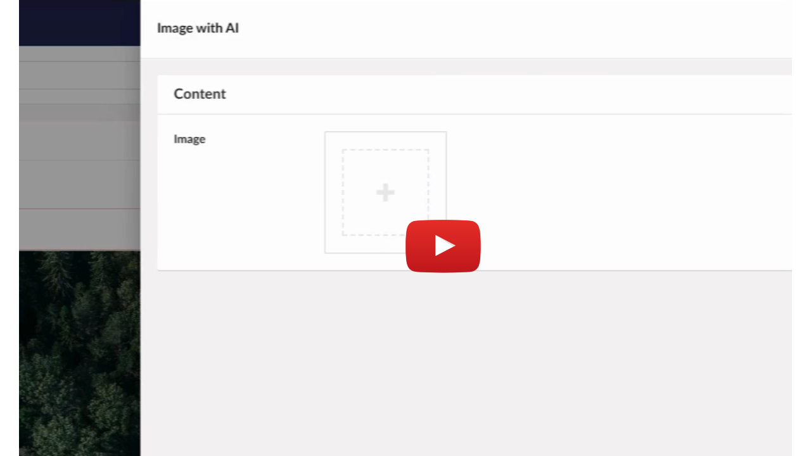

# UGenie - Umbraco GenAI Plugin

UGenie is a powerful GenAI plugin for Umbraco backoffice, designed to enhance content creation and management. It integrates seamlessly with Umbraco's rich text editor (RTE) and standard text editor to provide AI-powered content generation, text editing, and image generation. Powered by Microsoft's Semantic Kernel Connectors, it leverages multiple AI services to help you create and manage content more efficiently.

## Features

- **AI-Powered Content Generation**: Generate content directly in the Umbraco backoffice with the ability to create, edit, and paraphrase text.
- **AI Text Editing**: Edit and paraphrase your content using AI to improve readability and engagement.
- **Image Generation**: Generate images with AI using OpenAI and Azure OpenAI connectors, as well as an in-house generation option.
- **Seamless Integration**: Integrated with Umbraco's rich text editor (RTE) and normal text editor for smooth and easy content generation.
- **Supports Multiple AI Providers**: Uses Semantic Kernel Connectors for various AI services including OpenAI, Azure OpenAI, and in-house solutions.

## Installation

### Requirements
- Umbraco CMS 13.x.x < 14.x.x
- .NET 8.0 or higher

### Steps to Install

1. **Install via NuGet**:
   To install UGenie into your Umbraco project, run the following command in the NuGet Package Manager:
   ```bash
   Install-Package Phases.UGenie
   ```

2. **Add the Plugin to Your Umbraco Backoffice**:
   Once installed, UGenie will automatically be available in your Umbraco backoffice. It adds new functionality to the rich text editor (RTE) and the standard text editor for content generation, editing, and image generation.

3. **Configure API Keys**:
   - For **OpenAI** and **Azure OpenAI**, ensure you have the required API keys for authentication and set them up in your Umbraco configuration settings.
   - If you're using an **in-house image generation** solution, configure the necessary endpoints and credentials accordingly.

## Usage

### Text Generation
UGenie allows content creators to generate text directly within the Umbraco backoffice. Simply use the `Generation`, `EditGeneratedText`, or `Paraphrase` options in the rich text editor (RTE) or text editor.

1. **Generation**: Automatically generates content based on the prompt you provide.
2. **EditGeneratedText**: Refine or modify previously generated content using AI.
3. **Paraphrase**: Generate alternative versions of the existing content to improve readability and uniqueness.

### Image Generation
Generate images directly from within Umbraco's backoffice.

- Use the **Image Generation** option, which connects to the OpenAI and Azure OpenAI connectors, or use the in-house solution for creating images based on text descriptions.

## Configuration

UGenie supports configuration through the Umbraco backoffice. After installation, go to the "UGenie Settings" section in the Umbraco backoffice to configure your API keys, image generation preferences, and other options.

- **OpenAI**: Set your API key and choose the desired model for both text and image generation.
- **Azure OpenAI**: Set the required API key and model for the Azure service.
- **In-House Option**: Configure your in-house AI endpoint for both text and image generation.

### Configuration Screenshots

#### Default Model Configuration


*Setting up and model selection in Umbraco.*

#### Text generation API Configuration


*Configuring text generation options in Umbraco.*

#### Image Generation Configuration


*Configuring image generation options in Umbraco.*


## Screenshots

Below are some screenshots showing the UGenie plugin in action:


*Text generation in Umbraco RTE.*


*Editing and paraphrasing generated content in the Umbraco backoffice.*


*Image generation using AI in Umbraco.*

## Demo Video

Watch a demo of UGenie in action:

[](./UmbracoGenie/UmbracoGenie/Assets/Screenshots/UGenieScreenRecoding.mp4)

Click the thumbnail above to watch the demo video of UGenie generating content and images.

## Contributing

Contributions are welcome! If you'd like to contribute to the development of UGenie, please follow these steps:

1. Fork the repository.
2. Create a new branch for your feature or bug fix.
3. Make your changes and write tests to ensure your changes work.
4. Submit a pull request detailing your changes.

## License

UGenie is licensed under the MIT License.

## Authors

- **[Afreed](https://github.com/Afreed-cp)** - Developer and Creator of UGenie

## Acknowledgments

- [Umbraco CMS](https://umbraco.com/) for their flexible and powerful content management system.
- [Microsoft Semantic Kernel](https://learn.microsoft.com/en-us/semantic-kernel/) for providing the connectors and AI models used in this project.

---

For more information, please visit the [official documentation](https://github.com/phases/Phases.UGenie).
