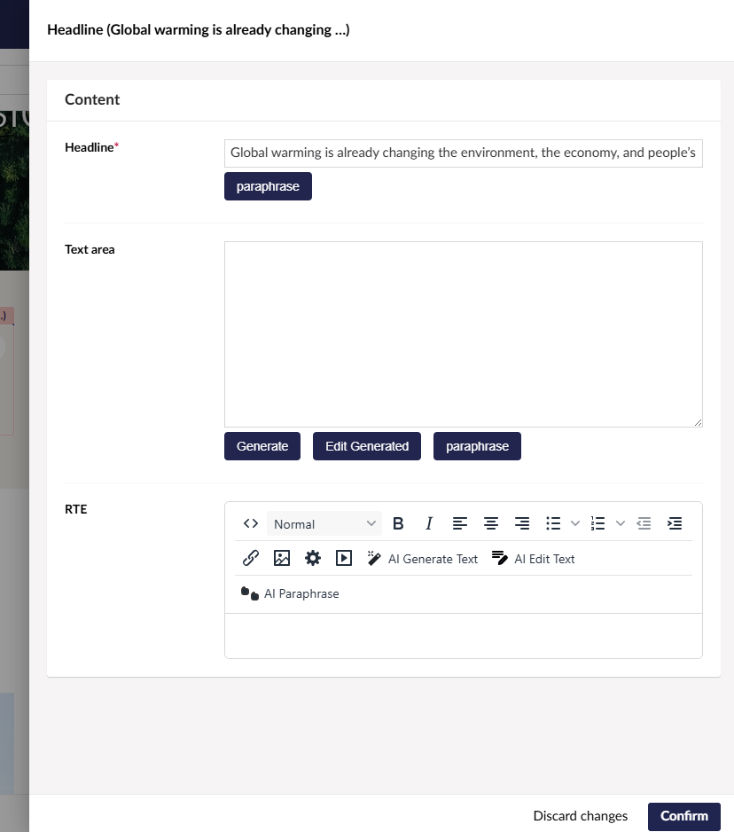

   
   
  

UGenie is a powerful GenAI plugin for Umbraco backoffice, designed to enhance content creation and management. It integrates seamlessly with Umbraco's rich text editor (RTE) and standard text editor to provide AI-powered content generation, text editing, and image generation. Powered by Microsoft's Semantic Kernel Connectors, it leverages multiple AI services to help you create and manage content more efficiently.

## Configuration

UGenie supports configuration through the Umbraco backoffice. After installation, go to the "UGenie Settings" section in the Umbraco backoffice to configure your API keys, image generation preferences, and other options.

- **OpenAI**: Set your API key and choose the desired model for both text and image generation.
- **Azure OpenAI**: Set the required API key and model for the Azure service.
- **In-House Option**: Configure your in-house AI endpoint for both text and image generation.

### Configuration Screenshots

#### Default Model Configuration

*Setting up and model selection in Umbraco.*

#### Text generation API Configuration

*Configuring text generation options in Umbraco.*

#### Image Generation Configuration

*Configuring image generation options in Umbraco.*

## Screenshots

Below are some screenshots showing the UGenie plugin in action:

*Text generation in Umbraco RTE.*

*Editing and paraphrasing generated content in the Umbraco backoffice.*

*Image generation using AI in Umbraco.*

## Demo Video
Watch a demo of UGenie in action:

Click the thumbnail above to watch the demo video of UGenie generating content and images.

For more information, please visit the [official documentation](https://github.com/phases/Phases.UGenie).
